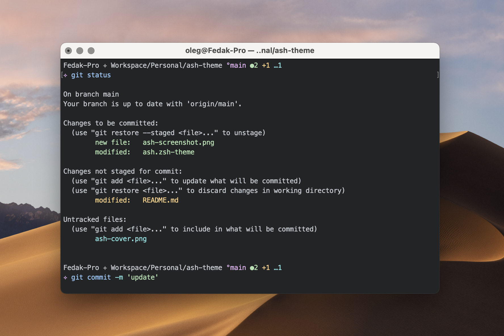

# Ash Theme of Terminal Prompts 

The theme works in zsh using oh-my-zsh. Optimised breaking the prompt lines and setting gaps between the bloks for readability. Git branch status information is provided.

    
   
    
   
<i>Color theme on the screenshot is from <a href="">Graymium</a></i>

    

## Installation

### **zsh**

Be sure to have [Oh My Zsh](https://ohmyz.sh) installed.

#### 1. Download theme:

    git clone --quiet https://github.com/olegfedak/ash-terminal-theme ~/.oh-my-zsh/custom/themes/ash

#### 2. Select theme:

    omz theme set ash/ash

#### 3. Reload current zsh session: 

    omz reload

### **fish, bash**

Since I am using Zsh, I haven’t considered this theme for Fish and Bash. Anyway the question is open and you are welcome being a contributor.

## License

This project is open source and available under the [MIT License](./LICENSE).